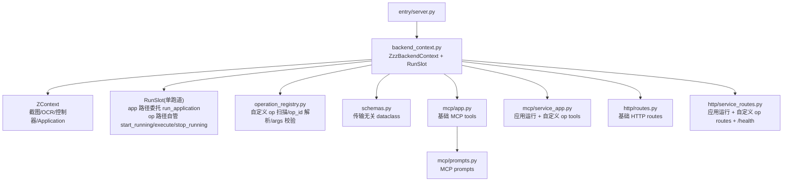

# 后端服务层架构

> `ZzzBackendContext` 是 `ZContext` 之上的传输无关 backend。它不关心调用方来自 MCP、HTTP 还是 GUI 管理页，只提供稳定的业务方法和运行状态。

## 概览



## 模块布局

```text
src/zzz_od/backend/
  schemas.py             # WindowStatus / AnalyzeScreenResult / RunStatusResult / ApplicationListResult / OperationListResult
  backend_context.py     # ZzzBackendContext + RunSlot（单槽，app/op 分派）
  operation_registry.py  # 自定义 op 扫描 / op_id 解析 / args 校验（纯反射，不实例化）
  mcp/
    app.py               # create_mcp_server + 基础 game tools
    service_app.py       # list_applications / run_one_dragon / run_standalone_app / list_operations / describe_operation / run_operation
    prompts.py           # MCP prompt 案例与注册
  http/
    routes.py            # register_http_routes + 基础 /game/* handler
    service_routes.py    # /health + 应用运行 + 自定义 op HTTP handler
  entry/
    server.py            # create_app / uvicorn 入口
```

## ZzzBackendContext

`ZzzBackendContext` 持有一个 `ZContext`，由服务入口注入。所有对外方法在进入业务逻辑前先检查 `ctx.ready_for_application`。

| 方法 | 作用 | 返回 |
|---|---|---|
| `check_window()` | 查询游戏窗口状态 | `WindowStatus` |
| `capture()` | 截取当前游戏画面 | RGB `MatLike` |
| `analyze()` | 截图 + OCR + 画面匹配 | `AnalyzeScreenResult` |
| `start_run(source, op_factory, display_name=None)` | 启动 operation（op 路径，供 `open_game` / `run_operation` 经适配器调用） | `(ok, future)` |
| `run_one_dragon(source)` | 按当前配置启动完整一条龙（app 路径） | `(ok, future)` |
| `run_standalone_app(source, app_id=None)` | 启动独立应用（app 路径） | `(ok, future)` |
| `list_applications()` | 列出当前实例可运行应用和独立应用选择状态（只读，不刷新配置） | `ApplicationListResult` |
| `query_status()` | 查询当前或最近一次运行状态（单槽，直接委托） | `RunStatusResult` |
| `stop()` | 发出停止信号（单槽） | `dict` |
| `close_game()` | 发关闭窗口信号，不走运行槽 | `str` |

> 自定义 operation 运行入口（`list_operations` / `describe_operation` / `run_operation`）不经过 `ZzzBackendContext` 方法，而是由 MCP / HTTP 适配器直接调用 `operation_registry`（扫描 / 解析 / 校验）+ `run_slot._start`（op 路径），详见 [mcp.md](mcp.md) / [http.md](http.md)。

## 运行槽

`ZzzBackendContext` 只持有**一个** `RunSlot`，所有运行（一条龙 / 独立应用 / `open_game` / 自定义 op）都经 `run_slot._start` 进入同一条单跑道。槽只做两件事：**单跑道调度** + **终态固化**；执行序列在槽内按 app / op 分派。

| 路径 | 触发入口 | 执行序列 | 进度句柄 | 结果来源 |
|---|---|---|---|---|
| **app** | `run_one_dragon` / `run_standalone_app` | 委托 `run_application`（复用 GUI/CLI 共享入口，内含 `start_running` / 绑定 / `execute` / `stop_running`） | `run_context.current_application` | `run_context.last_application_result` |
| **op** | `open_game` / `run_operation`（自定义 op） | 槽自己 `start_running → op_factory(ctx) → op.execute() → stop_running` | 槽内 `current_op` | `op.execute()` 返回值 |

- **单跑道互斥**收进 `_start` 锁内：`future` 未完成检查与 `executor.submit` 在同一把锁中原子完成（check-then-submit），消除跨槽 check-then-act 竞态；框架层 `run_context.start_running` 不可重入是第二重保证。
- **字段**（单一事实源）：`source`、`op_id`（app 路径=app_id、op 路径=`package.path.ClassName` 或类名）、`run_type`（`APPLICATION` / `OPERATION`）、`app`（展示名，`_run` 内固化）、`started_at` / `finished_at`、`terminal_state`、`last_status`、`failed_node`、`current_op`（op 路径回填，app 路径为 `None`）。
- **终态固化**：`_run` 用顶层 try/except/finally 包裹，任何路径（含 `refresh_config` / `run_application` 抛异常）都固化 `terminal_state`，避免卡 `RUNNING`。
- **进度读取**统一：`_query_status` 在运行态读 `progress = current_op or run_context.current_application`（Application 也是 Operation，都有 `_current_node` / `node_retry_times`）；终态读固化的 `terminal_state`。
- **配置刷新**：app 路径把 `_refresh_runtime_config` 作为 `refresh_config` 钩子注入 `_run`（槽线程内、`_start` 已赢锁后、`run_application` 前执行）——拒绝路径不进 `_run`，因此不刷新，修原跨方法刷新竞态；`current_instance_idx` 在刷新后重读（可能切实例）。`list_applications` 是只读路径，**不**刷新配置。
- **stop**：`_stop` 对未完成运行调 `run_context.stop_running()` 发信号；operation 实际退出有过渡期，期间 `_query_status` 仍报 `running`（`RunState` 无 `STOPPING` 态，沿用现状）。

`ZzzBackendContext.query_status()` 和 `ZzzBackendContext.stop()` 各自塌缩为一次 `run_slot._query_status()` / `_stop()`，不再跨槽仲裁。

## 自定义 operation 运行入口

`operation_registry.py` 提供「按 operation 运行」的通用能力（不框死为调试；当前主用于开发者复现 bug 时逐个 op 精确定位，未来智能体可经此自由组合 op）：

- `scan_operations(ctx, refresh=False)`：扫描 `zzz_od.operation` + `zzz_od.hollow_zero` 承载包，三重过滤（`__module__` 守卫 + 显式抽象基类集 + `*Base` 兜底 + 排除 `Application` 子类），纯反射 `__init__` 参数（**不实例化**），结果缓存。
- `resolve_op_class(op_id)`：按 `<dotted module path>.<ClassName>` 解析出 Operation 子类（`importlib` + `__module__` 守卫 + `issubclass(cls, Operation)`）。
- `validate_args(cls, args)`：校验必填参数齐全 + 无复杂数据类参数（`ChargePlanItem` 等拒绝，提示走 application）+ 值可 JSON 序列化。
- `describe_operation(ctx, op_id)`：纯反射返回单个 op 的参数 schema（每个参数标 `json_serializable`）。

`run_operation` 在适配器侧组合上述能力：`resolve_op_class` + `validate_args` 先校验，通过后把 `cls` + `args` 烤进闭包 `op_factory = lambda ctx: cls(ctx, **args)`，提交 `run_slot._start`（op 路径，`display_name=op_id`）。槽只认统一签名 `op_factory(ctx) → Operation`，对 `open_game` 与自定义 op 一视同仁。

## 适配器

MCP 与 HTTP 只做传输适配：

- MCP 基础工具在 `mcp/app.py`，应用运行 + 自定义 op 工具在 `mcp/service_app.py`，prompt 在 `mcp/prompts.py`。
- HTTP 基础端点在 `http/routes.py`，应用运行 + 自定义 op 和 `/health` 在 `http/service_routes.py`。
- 应用运行类 tool / 端点只调 `ZzzBackendContext` 公开方法；自定义 op 类 tool / 端点额外经 `operation_registry` 校验后调 `run_slot._start`（op 路径）。

## 进程模型

- `entry/server.py` 是 headless server 入口，会创建独立 `ZContext`。
- GUI 主程序仍是另一个入口；「开发工具 -> MCP 服务」页面启动的是本机 server 子进程。
- 当前只保证同一 backend 进程内的运行互斥；GUI 主进程与外置 server 子进程之间不做跨进程互斥。

## 路线图（尚未实现）

- 事件推送：WebSocket / SSE 或 MCP notifications。
- 多实例：`list_instances` / `switch_instance`。
- 更多 game 感知与交互 tool。
- 更完整的 AI 操作范式。

## 相关文档

- [README.md](README.md) - 总览
- [mcp.md](mcp.md) - MCP 适配器
- [http.md](http.md) - HTTP 适配器
- [entry.md](entry.md) - 服务入口
